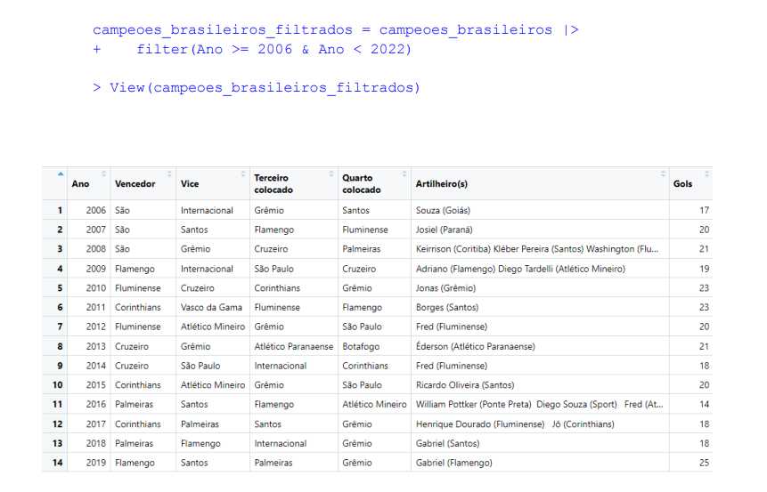

# Aproveitamento dos Mandantes no Campeonato Brasileiro
## Projeto de Dados


<p align="center" width="100%">
    
    
    
</p>


> Este projeto referente ao estudo sobre sistemas inteligentes, tem como objetivo a análise de dados utilizando a linguagem R. No estudo em questão fiz uma pesquisa sobre o aproveitamento sobre os times do Campeonato Brasileiro, onde se fala muito sobre o os mandantes terem uma certa vantagem sobre os visitantes, já que jogam em casa com sua torcida. E selecionamos o caso do Brasileirão de 2020, onde o time mandante jogou sem torcida devido a pandemia do Covid-19.


> Para mais Informações, ler o [ RELATORIO ](https://docs.pipz.com/central-de-ajuda/learning-center/guia-basico-de-markdown#open)

### Ajustes e melhorias

O projeto ainda está em desenvolvimento e as próximas atualizações serão voltadas nas seguintes tarefas:

- [x] Analise de Gols feitos
- [x] Análise de Desempenho durante o campeonato de pontos corridos
- [x] Análise de Desempenho durante a pandemia do Covid-19
- [x] Conclusão


## 💻 Pré-requisitos

Antes de começar, verifique se você atendeu aos seguintes requisitos:

* Você instalou a versão mais recente de `<Rstudio / R / Datasets>`
* Você tem uma máquina `<Windows / Linux / Mac>`. 


```

